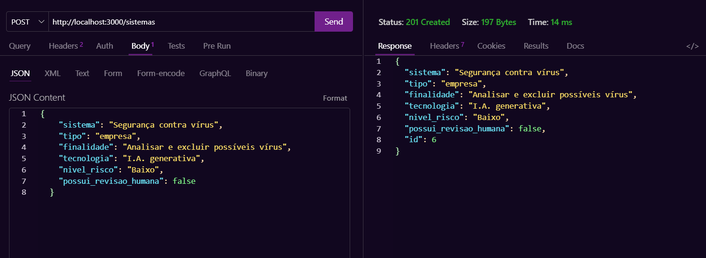
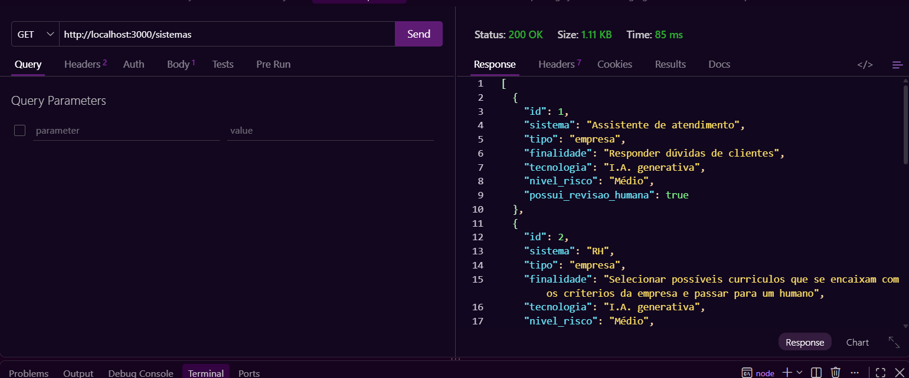
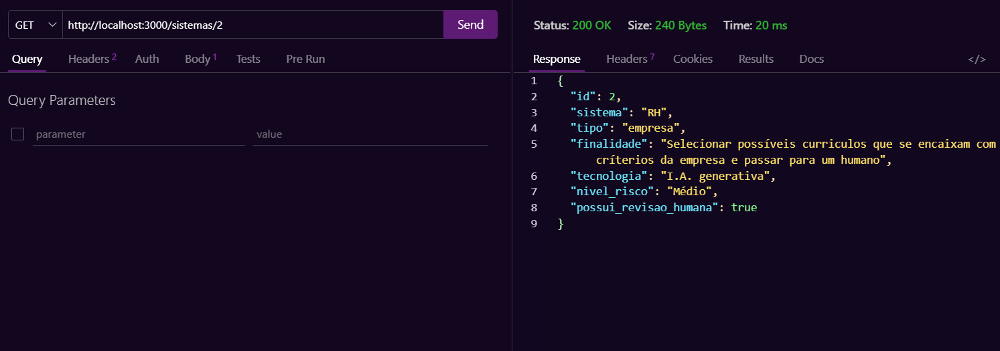
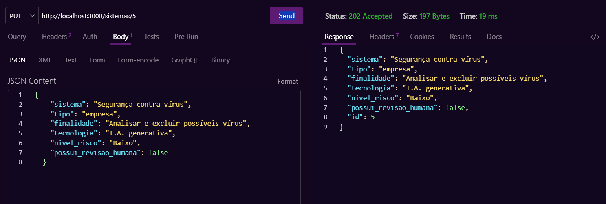
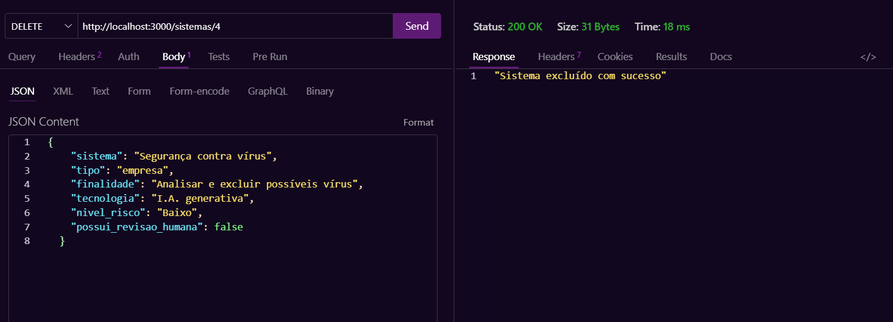
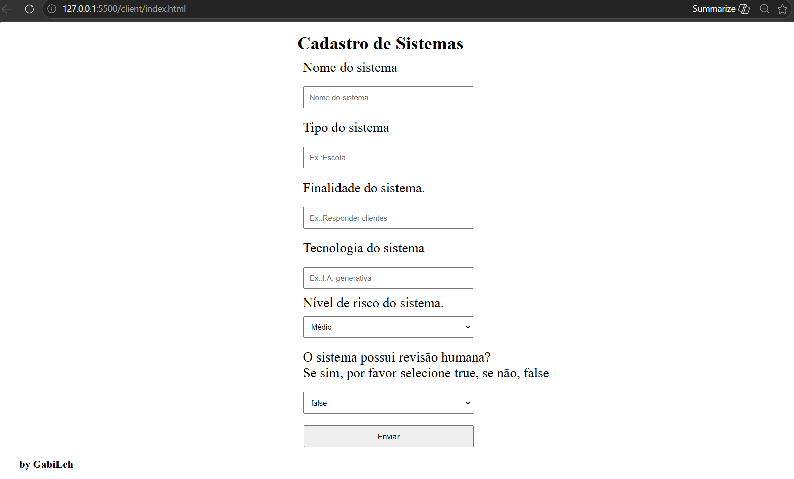
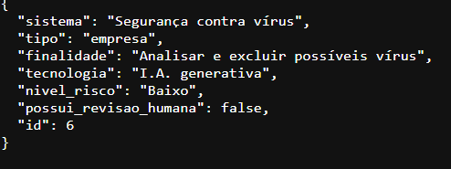

# Avaliação de back-end --------- Tema 02 // Pesquisa de campo

---

## Contextualização do problema

Um pesquisador da Faculdade de Jaguariúa precisa de um Banco de usos de Inteligência Artificial, faça um catálogo para registrar como empresas, escolas ou pessoas estão utilizando IA, incluindo finalidade e possíveis riscos com no mínimo 5 objetos.

## Tecnologias
- **Node.sj**
- **JavaScript**
- **VsCode**
- **VsCode** Thunder Client

---

## Passos para testar
- 1 Clone este repositório
- 2 Abra com **VsCode** e em um terminal digite:
```bash
npm install
npm run dev
```
- 3 Teste as rotas com a extensão `Thunder Client` do **VsCode**
- 4 Abra o arquivo client/index.html com a extensão `Live Server` do **VsCode**

---

## Print dos testes e exemplo de requisições
- CREATE

- READ ALL

- BUSCAR

- UPDATE

- DELETE


---

## Cliente

- Resposta:
<br>